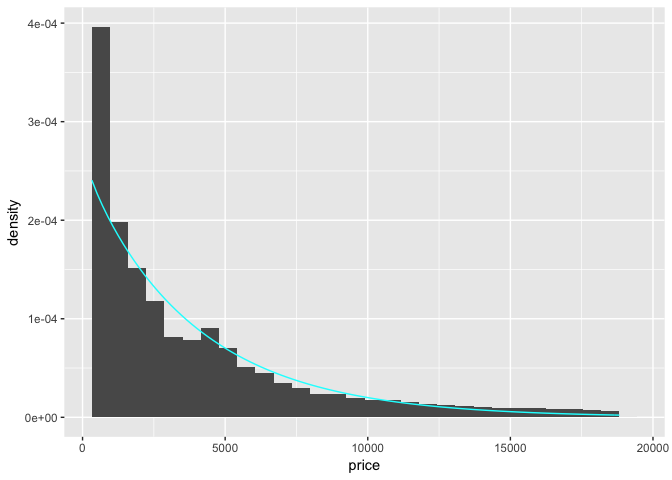

Maximum Likelihood Estimation
================

-   [Moment Matching](#moment-matching)
-   [Maximum Likelihood Estimation](#maximum-likelihood-estimation)
-   [Exercises](#exercises)
    -   [Fitting!](#fitting)
    -   [Working on subsets](#working-on-subsets)
    -   [Getting nuts: fitting gamma with beta.](#getting-nuts-fitting-gamma-with-beta.)

This is the companion notebook to the course on Maximum Likelihood.

``` r
if (!require("bbmle")) install.packages("bbmle") # Only installs if missing
library(bbmle)
library(tidyverse)
```

Moment Matching
---------------

In this section, we estimate parameters using moment matching: the parameters must be chosen such that the first moments observed in the data match the theoretical ones.

Let's try to fit an exponential distribution to the prices of diamonds. The average of an exponential law is the inverse of its parameter (and vice-versa).

``` r
m <- mean(diamonds$price)  # Average price
ggplot(diamonds, aes(x = price)) + geom_histogram(aes(y = ..density..)) + stat_function(fun = dexp, args = list(1/m), color = "red")
```


A (possibly) better fit could be obtained by a family with 2 parameters: let's try the gamma distribution.

``` r
m <- mean(diamonds$price) # Average price
v <- var(diamonds$price)  # Variance of prices
ggplot(diamonds, aes(x = price)) + geom_histogram(aes(y = ..density..)) + stat_function(fun = dgamma, args = list(shape = m^2/v, rate = m/v), color = "cyan")
```



The difference between the two curves is hard to distinguish.

Maximum Likelihood Estimation
-----------------------------

Below, we perform the MLE of the price distribution. We scale the prices by a kilo factor and use a target gamma distribution. We use two different functions: mle (old) and mle2 (new). The latter is more user-friendly. Below, we show that they yield the same output.

``` r
par <- mle2(price / 1000 ~ dgamma(shape, rate), start = list(shape = 2, rate = 2), data = diamonds) # Using the new package; WARINING: prices were scaled.
par@coef # Just to see the values of the parameters 
```

    ##     shape      rate 
    ## 1.1580360 0.2944673

``` r
nLL <- function(s, r) -sum(stats::dgamma(diamonds$price / 1000, s, r, log = TRUE)) # Using the old package
fit <- mle(nLL, start = list(s = 2, r = 2))
fit@coef # Again, just having a look: they match!
```

    ##         s         r 
    ## 1.1580360 0.2944673

``` r
diamonds %>% ggplot() + geom_histogram(aes(x = price / 1000, y = ..density..)) + stat_function(fun = dgamma, args = list(shape = fit@coef[1], rate = fit@coef[2]), color = "red") # Plot
```

    ## `stat_bin()` using `bins = 30`. Pick better value with `binwidth`.


The difference with the moment-matching density is the small bump close to zero.

A more difficult task is to fit a parametric distribution to the distribution of diamond weights. Indeed, the empirical distribution is far from smooth because spikes appear around 'round' values of carat (1, 1.5, 2, 2.5, etc.).

``` r
par <- mle2(carat ~ dgamma(shape, rate), start = list(shape = 1, rate = 2), data = diamonds) # Using the new package
par@coef # The estimated parameters
```

    ##    shape     rate 
    ## 3.111010 3.898804

``` r
nLL <- function(s, r) -sum(stats::dgamma(diamonds$carat, shape = s, rate = r, log = TRUE)) # Using the old package
fit <- mle(nLL, start = list(s = 2, r = 2))
fit@coef # The estimated parameters
```

    ##        s        r 
    ## 3.111011 3.898804

``` r
diamonds %>% ggplot() + geom_histogram(aes(x = carat, y = ..density..), bins = 50) + stat_function(fun = dgamma, args = list(shape = fit@coef[1], rate = fit@coef[2]), color = "red")
```


It is hard in this case to find the fit very impressive.

Exercises
---------

### Fitting!

1.  Set your working directory, load the tidyverse package & import the ANES dataset.
2.  Replace the (or create a new) age variable with its normalized value: (Age - 15) / 80.
3.  Check that the new variable lies between 0 and 1 (plot a histogram for instance, or look at the summary). BEWARE: if extreme values are reached (0 or 1), the optimizer might not like it.
4.  Fit this scaled age variable with a beta distribution.
5.  Plot the corresponding distribution over the histogram.

### Working on subsets

Perform the same analysis on the male/female subsets. Compare the two!

### Getting nuts: fitting gamma with beta.

1.  Create new data with the commands below:
    n\_sample &lt;- 10^5
    y &lt;- rgamma(n\_sample,2,2)
    y &lt;- y/max(y+1)
    x &lt;- 1:n\_sample
    data &lt;- data.frame(x, y)
2.  Again, fit a beta distribution on y. Plot the data and fitted distribution.
3.  Same question with a gamma law. Look at the graphical difference between the two.
